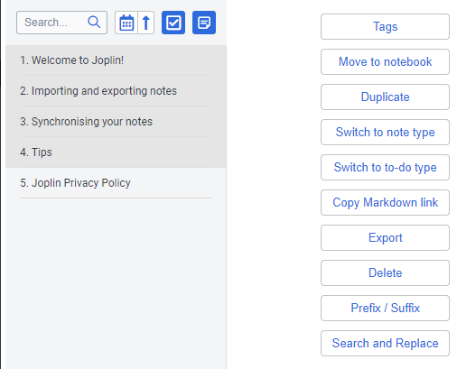
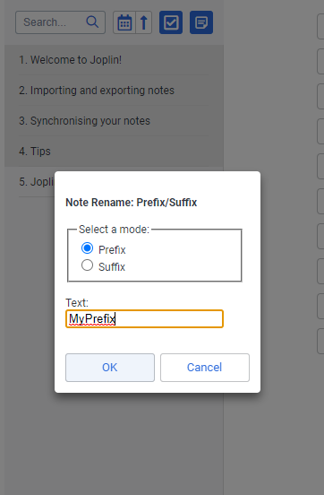
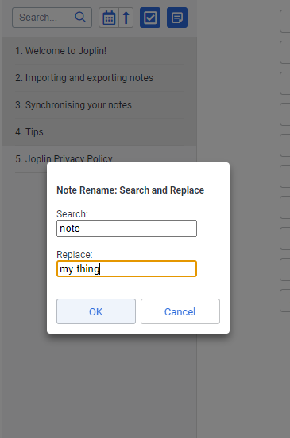

# Joplin Plugin: Note Rename

Rename [Joplin](https://joplinapp.org/) note titles in bulk by adding a prefix, suffix, or by search and replace.

## Usage
This plugin works by altering the titles of the currently-selected notes. Select some notes in the notes list and two buttons will appear in the notes list toolbar: **Prefix / Suffix** and **Search and Replace**.

There are similar options in the **Tools** menu and the right-click context menu for the selected notes. Click the button or menu item for the operation you'd like to perform.

### Prefix / Suffix

This command adds a prefix or suffix to the selected notes. First, select a mode option:
* **Prefix** will add the text in the input box to the beginning of the note title.
* **Suffix** will add the text in the input box to the end of the note title.

Type the text that you would like to add into the **Text** box. 

To perform the operation, click **OK**. If you've changed your mind, click **Cancel**.

### Search and Replace

This command will search the selected notes for the text in the **Search** input box. It will then replace that text with the value of the **Replace** input box.

To perform the operation, click **OK**. If you've changed your mind, click **Cancel**.

## Plugin Development
### Building the plugin

The plugin is built using Webpack, which creates the compiled code in `/dist`. A JPL archive will also be created at the root, which can use to distribute the plugin.

To build the plugin, simply run `npm run dist`.

The project is setup to use TypeScript, although you can change the configuration to use plain JavaScript.

### Updating the plugin framework

To update the plugin framework, run `npm run update`.

In general this command tries to do the right thing - in particular it's going to merge the changes in package.json and .gitignore instead of overwriting. It will also leave "/src" as well as README.md untouched.

The file that may cause problem is "webpack.config.js" because it's going to be overwritten. For that reason, if you want to change it, consider creating a separate JavaScript file and include it in webpack.config.js. That way, when you update, you only have to restore the line that include your file.

## License
[CC0](./LICENSE)
